<p align="center">
  
</p>

<h1 align="center">RAG 智能文档问答系统</h1>

<p align="center">
  一个面向多格式文档的智能检索增强问答平台，支持文档解析、向量检索、引用溯源、对话管理与模型配置。
</p>

<p align="center">
  
  
  
  
  
  
</p>

---

## 目录

- [项目简介](#项目简介)
- [项目结构](#项目结构)
- [核心亮点](#核心亮点)
- [功能演示](#功能演示)
- [技术栈](#技术栈)
- [系统架构](#系统架构)
- [功能全景](#功能全景)
- [数据库设计](#数据库设计)
- [快速开始](#快速开始)
- [接口文档](#接口文档)
- [模型配置](#模型配置)
- [测试与构建](#测试与构建)
- [常见问题](#常见问题)
- [项目状态](#项目状态)

---

## 项目简介

`RAG 智能文档问答系统` 是一个完整可运行的文档知识问答平台。系统将传统文档管理、检索增强生成和大语言模型问答整合到同一个工作流中：用户上传文档后，系统自动完成文本解析、分块、Embedding、向量入库；提问时再从向量库检索相关片段，并由 LLM 生成带引用依据的回答。

项目不是静态界面原型，而是前端、Spring Boot 后端、Python RAG 服务、MySQL 数据库与 Chroma 向量库共同组成的全栈应用。它适合用于课程设计、RAG 原型验证、文档问答场景演示和二次开发。

支持的文档格式：

- `PDF`
- `TXT`
- `DOCX` / `DOC`
- `XLSX` / `XLS`

---

## 项目结构

```text
RAG-LLM/
├── frontend/                         # React + Vite 前端应用
│   ├── src/api/                       # 前端 API 请求封装
│   ├── src/assets/                    # 前端图片与静态资源
│   ├── src/data/                      # 前端静态数据与默认选项
│   ├── src/features/                  # 工作台、文档、问答、设置等页面模块
│   ├── src/test/                      # 前端测试环境与测试工具配置
│   ├── src/types/                     # 前端 TypeScript 类型
│   └── src/utils/                     # 通用工具函数
├── backend/                           # Spring Boot 后端服务
│   ├── src/main/java/com/example/ragllm/
│   │   ├── config/                    # 跨域、时钟等基础配置
│   │   ├── document/                  # 文档、处理流程、对话、引用等业务接口
│   │   ├── settings/                  # 系统设置与模型配置接口
│   │   ├── observability/             # 请求日志与可观测接口
│   │   └── status/                    # 服务状态接口
│   └── src/main/resources/
│       ├── application.properties     # 后端运行配置
│       └── schema.sql                 # MySQL 表结构初始化脚本
├── rag-service/                       # Python FastAPI RAG 服务
│   ├── pyproject.toml                 # Python 项目依赖与打包配置
│   ├── src/rag_service/main.py        # FastAPI 应用入口与 HTTP 接口
│   ├── src/rag_service/service.py     # 文档入库、检索和问答编排
│   ├── src/rag_service/providers.py   # Gemini、OpenRouter 等模型 Provider
│   ├── src/rag_service/vector_store.py # Chroma 向量库封装
│   └── src/rag_service/documents/     # 文档格式识别、解析和文本分块
├── docs/ui-reference/                 # 页面 UI 参考图
├── assets/readme/                     # README 使用的 Logo 与演示截图
├── uploads/                           # 本地运行时上传文件目录，默认不提交
├── .env.example                       # 环境变量模板
└── README.md
```

代码分层说明：

- 前端只负责页面交互和接口调用，不直接保存密钥或访问模型服务。
- 后端负责业务状态、MySQL 持久化、文件落盘和调用 RAG 服务。
- FastAPI RAG 服务负责文档解析、文本分块、Embedding、向量检索和 LLM 生成。
- MySQL 保存业务数据，Chroma 保存向量索引，`uploads/` 保存原始上传文件。

---

## 核心亮点

### 1. 多格式文档接入

系统支持 PDF、纯文本、Word 和 Excel 文档。上传后会生成文档记录、处理流程、文本块、向量索引和最近动态，方便追踪每个文档从上传到可问答的完整过程。

### 2. 真实 RAG 流程

问答不是直接把问题发给大模型，而是经过以下流程：

```text
用户问题 -> Query Embedding -> 向量检索 Top-K -> 构造上下文 -> LLM 生成回答 -> 返回引用片段
```

回答会尽量依据检索到的文档片段生成，并保留引用编号、片段内容、相似度等信息，方便回到原始资料核对。

### 3. 文档处理过程可视化

文档详情页展示处理流程、处理耗时、文本块预览、向量库状态和模型配置。重新处理文档时，系统会重新计算处理开始时间、步骤状态和处理结果，避免旧数据误导当前状态。

### 4. 对话历史与引用溯源

系统按文档管理对话会话，支持新建、切换、删除和导出对话。AI 回答支持 Markdown 与 LaTeX 渲染，引用片段也会保存到数据库，刷新后仍可查看历史上下文。

### 5. 可配置模型与 RAG 策略

系统设置页面支持切换 LLM、Embedding 模型和 RAG 参数，包括温度、最大输出长度、Top-K、相似度阈值、分块大小、分块重叠、是否流式输出等。配置会持久化到后端数据库。

### 6. 请求可观测

后端和 RAG 服务都提供请求日志接口，可以查看浏览器到后端、后端到 RAG、RAG 到模型服务的调用摘要，便于定位上传、解析、检索或生成过程中的问题。

---

## 功能演示

### 1. 工作台总览

展示内容：文档总数、已解析文档、对话总数、支持格式、最近上传文档、最新动态、处理状态和快捷入口。

<p align="center">
  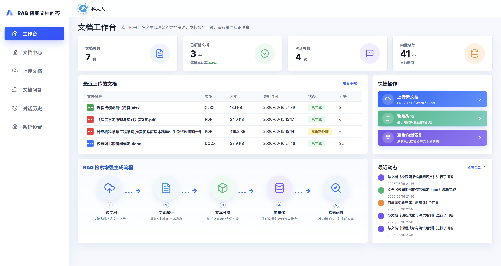
</p>

### 2. 文档上传与处理进度

展示内容：批量上传、上传队列、解析配置、上传说明，以及文档从上传到向量入库的处理进度。

<table>
  <tr>
    <td width="50%">
      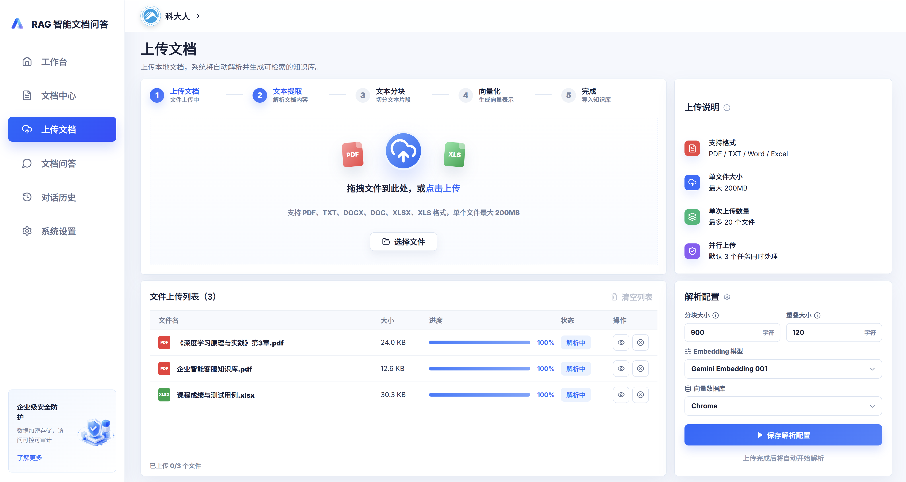
    </td>
    <td width="50%">
      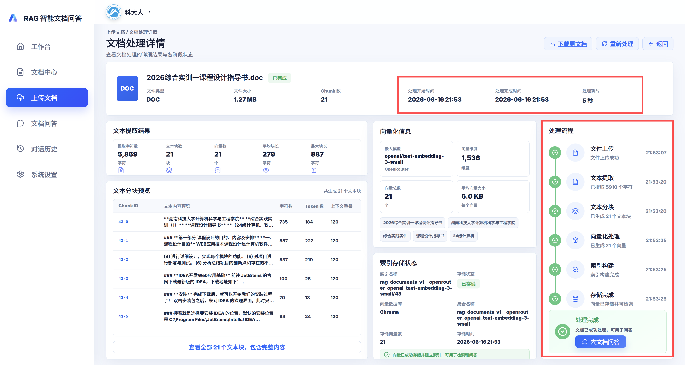
    </td>
  </tr>
</table>

### 3. 文档中心与筛选

展示内容：文档列表、关键词搜索、日期筛选、来源筛选、状态筛选、重新处理、下载原文、删除文档和处理状态。

<p align="center">
  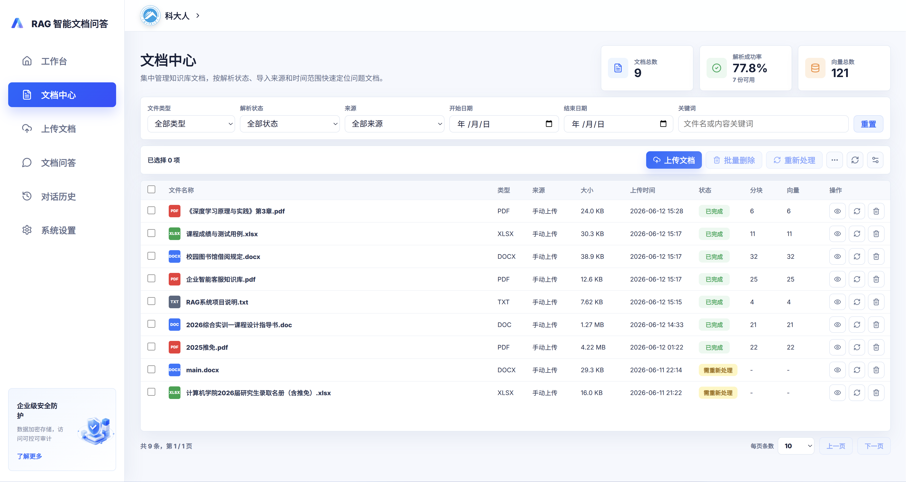
</p>

<table>
  <tr>
    <td width="50%">
      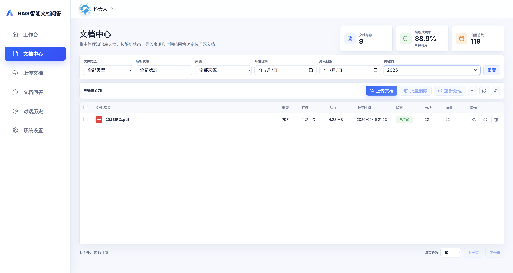
    </td>
    <td width="50%">
      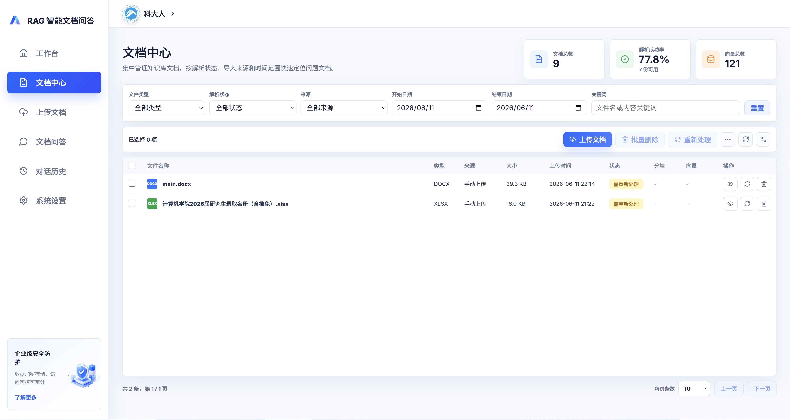
    </td>
  </tr>
  <tr>
    <td width="50%">
      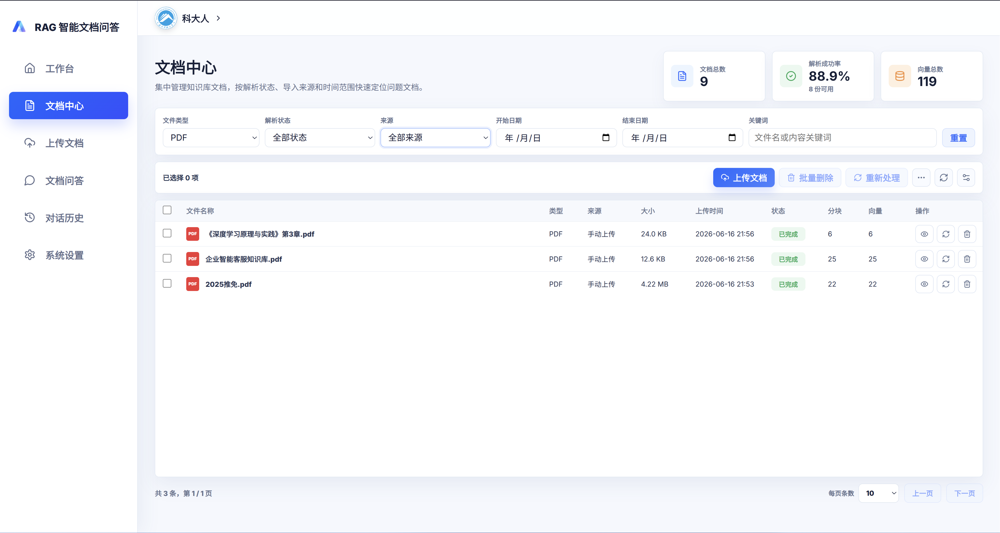
    </td>
    <td width="50%">
      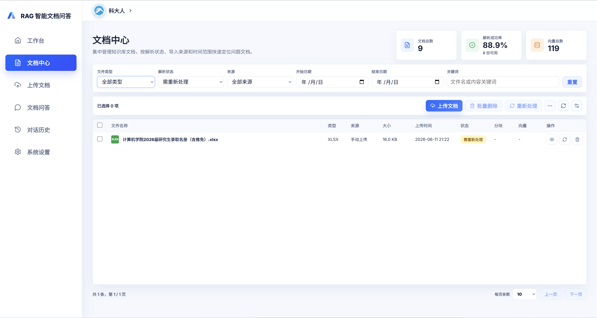
    </td>
  </tr>
</table>

### 4. 文档处理详情与文本块预览

展示内容：处理流程、处理耗时、文本提取结果、文本块预览、索引存储状态和模型配置。

<table>
  <tr>
    <td width="50%">
      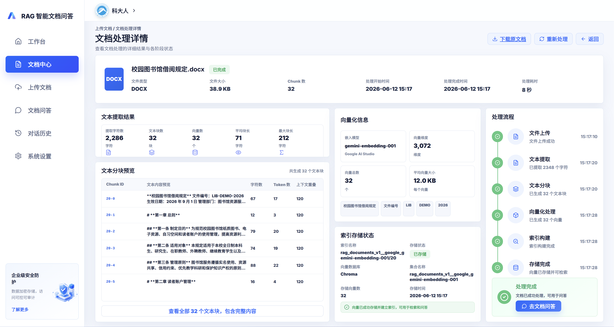
    </td>
    <td width="50%">
      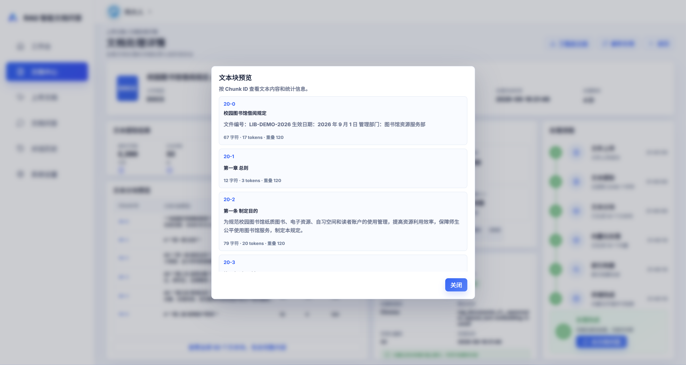
    </td>
  </tr>
</table>

### 5. 文档问答与引用片段

展示内容：选择文档、发送问题、流式回答、Markdown/LaTeX 渲染、引用片段、相似度和片段溯源。

<table>
  <tr>
    <td width="50%">
      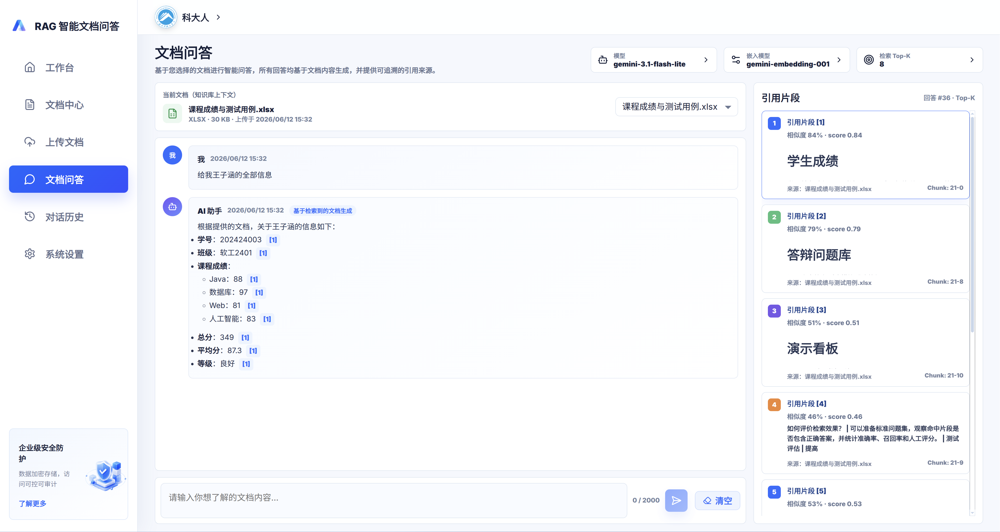
    </td>
    <td width="50%">
      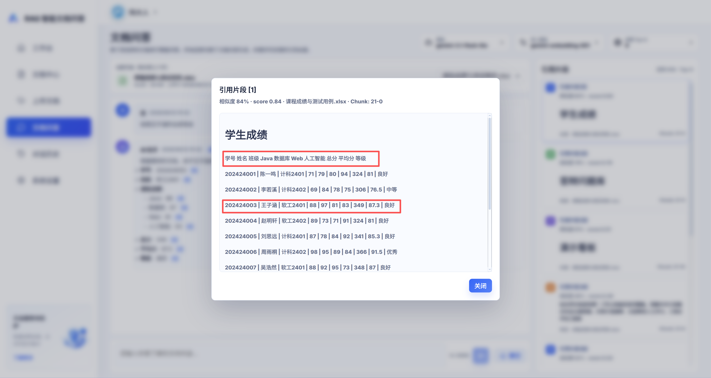
    </td>
  </tr>
</table>

### 6. 对话历史

展示内容：历史会话列表、会话切换、对话详情、引用记录、删除和导出。

<p align="center">
  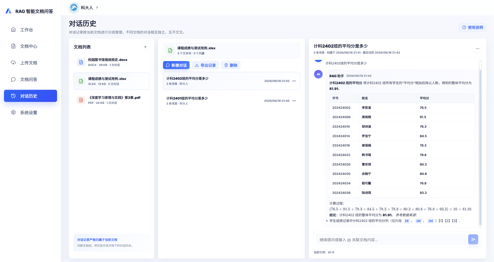
</p>

### 7. 系统设置

展示内容：LLM 配置、Embedding 配置、RAG 策略配置、模型连接状态和参数持久化。

<p align="center">
  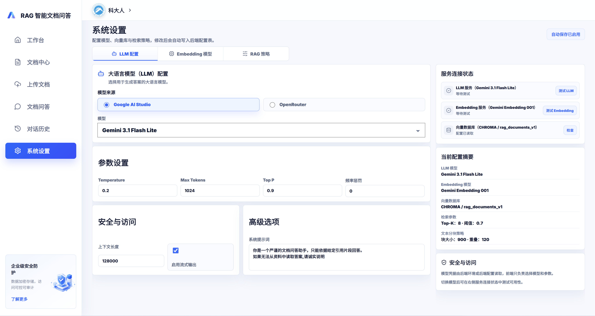
</p>

<table>
  <tr>
    <td width="50%">
      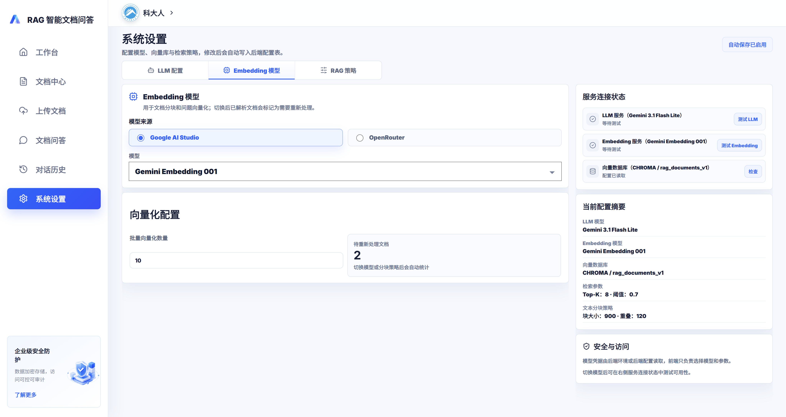
    </td>
    <td width="50%">
      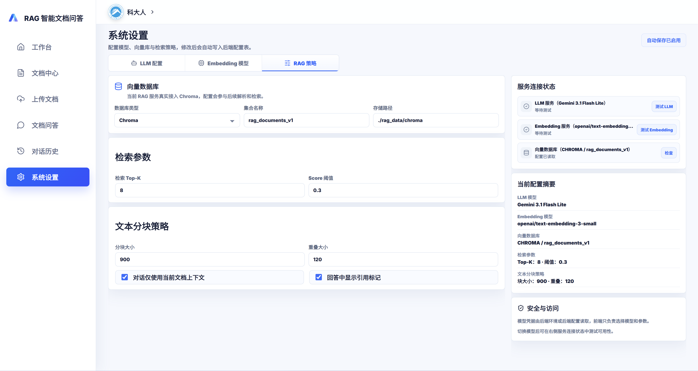
    </td>
  </tr>
</table>

### 8. 接口文档

展示内容：Spring Boot Swagger UI 与 FastAPI RAG Docs。

<table>
  <tr>
    <td width="50%">
      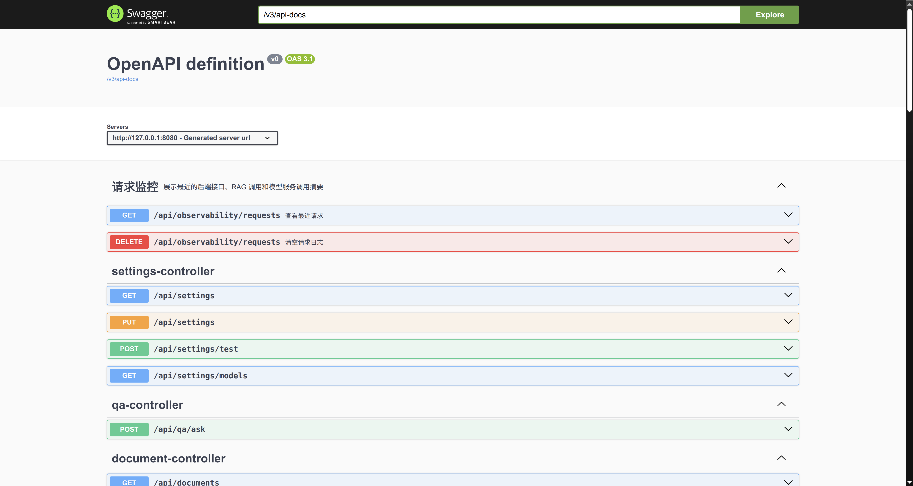
    </td>
    <td width="50%">
      
    </td>
  </tr>
</table>

---

## 技术栈

### 前端

- `React`
- `Vite`
- `TypeScript`
- `Lucide React`
- `React Markdown`
- `remark-gfm`
- `remark-math`
- `rehype-katex`

### 后端

- `Spring Boot`
- `Spring JDBC`
- `MySQL 8`
- `Springdoc OpenAPI`
- `JUnit`

### RAG 服务

- `FastAPI`
- `Chroma`
- `Google Gemini API`
- `OpenRouter API`
- `MinerU API`
- `Pytest`

### 数据与存储

- `MySQL`：文档、处理步骤、系统设置、对话、消息、引用片段
- `Chroma`：文档向量索引
- `uploads/`：原始上传文件
- `rag-service/rag_data/chroma/`：本地向量库持久化目录

---

## 系统架构

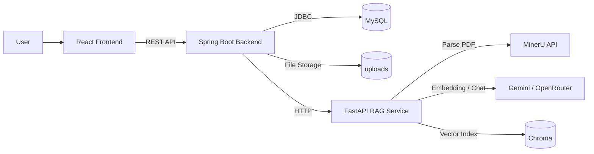

数据流说明：

1. 前端负责页面渲染、交互、文档上传、问答输入和结果展示。
2. Spring Boot 后端负责业务接口、MySQL 持久化、文件落盘和调用 RAG 服务。
3. RAG 服务负责文档解析、文本分块、Embedding、向量检索和问答生成。
4. MySQL 保存业务数据，Chroma 保存向量索引，原始文件保存在本地上传目录。

---

## 功能全景

### 工作台

- 文档、解析、对话和格式统计
- 最近上传文档
- 最新动态
- 处理状态概览
- 快捷入口跳转

### 文档管理

- 上传 PDF、TXT、Word、Excel
- 批量上传
- 查看文档状态
- 日期、状态和来源筛选
- 下载原文
- 删除文档
- 重新处理文档

### 文档处理详情

- 查看处理流程
- 查看真实处理耗时
- 查看文本提取指标
- 预览文本块
- 查看向量索引状态
- 查看当前模型配置

### 文档问答

- 选择指定文档提问
- 检索相关片段
- 生成引用式回答
- Markdown 渲染
- LaTeX 公式渲染
- 引用片段高亮与详情查看
- 支持流式输出

### 对话历史

- 新建会话
- 切换会话
- 删除会话
- 导出对话
- 查看历史引用

### 系统设置

- LLM 模型选择
- Embedding 模型选择
- RAG 策略参数配置
- 系统提示词配置
- 模型连接状态查看
- 配置自动持久化

---

## 数据库设计

系统使用 MySQL 保存业务数据，后端启动时会根据 `backend/src/main/resources/schema.sql` 自动初始化表结构。向量数据由 Chroma 独立保存，原始上传文件保存在本地文件目录中。

### 核心数据表

| 表名 | 说明 |
| --- | --- |
| `documents` | 文档主表，保存文件名、格式、来源、状态、大小、存储路径、RAG 文档 ID、分块数、向量数、错误信息、上传时间和更新时间。 |
| `document_processing_steps` | 文档处理步骤表，保存每个文档在上传、文本提取、文本分块、向量化、存储完成等阶段的状态、说明、时间和顺序。 |
| `document_activity_events` | 文档动态表，保存工作台“最新动态”所需的上传、删除、处理完成、处理失败等事件。 |
| `chat_sessions` | 对话会话表，按文档保存会话标题、状态、创建时间和更新时间。 |
| `chat_messages` | 对话消息表，保存用户消息、AI 回复、消息状态、错误信息和创建时间。 |
| `chat_citations` | 引用片段表，保存 AI 回复关联的文档片段、相似度、片段编号、页码和引用文本。 |
| `system_settings` | 系统配置表，保存 LLM、Embedding、向量库、分块、检索和生成参数。 |

### 存储边界

| 数据类型 | 存储位置 |
| --- | --- |
| 文档元数据、处理状态、对话记录、引用片段、系统配置 | MySQL |
| 原始上传文件 | `uploads/` |
| 文本向量和向量索引 | `rag-service/rag_data/chroma/` |
| API Key 和本地端口配置 | `.env` |

这种拆分可以避免把大文件和高维向量直接塞进业务表，同时让文档状态、对话历史和系统配置保持可查询、可维护。

---

## 快速开始

### 1. 克隆项目

```bash
git clone https://github.com/ofb241223-dotcom/RAG-LLM.git
cd RAG-LLM
```

### 2. 准备环境

建议环境：

- Node.js 20+
- Java 21+
- Maven 3.9+
- Python 3.11+
- MySQL 8+
- LibreOffice，用于解析老格式 `.doc` 文件

检查命令：

```bash
node -v
npm -v
java -version
mvn -v
python3 --version
mysql --version
```

### 3. 创建 MySQL 数据库

使用 MySQL root 用户执行：

```sql
CREATE DATABASE IF NOT EXISTS rag_llm
  CHARACTER SET utf8mb4
  COLLATE utf8mb4_unicode_ci;

CREATE USER IF NOT EXISTS 'rag_llm'@'localhost'
  IDENTIFIED BY 'rag_llm_password';

GRANT ALL PRIVILEGES ON rag_llm.* TO 'rag_llm'@'localhost';
FLUSH PRIVILEGES;
```

### 4. 配置环境变量

复制模板：

```bash
cp .env.example .env
```

编辑 `.env`，至少配置：

```properties
BACKEND_PORT=8080
RAG_DB_URL=jdbc:mysql://localhost:3306/rag_llm?useUnicode=true&characterEncoding=utf8&serverTimezone=Asia/Shanghai
RAG_DB_USERNAME=rag_llm
RAG_DB_PASSWORD=rag_llm_password

RAG_SERVICE_PORT=8000
RAG_SERVICE_URL=http://localhost:8000
CHROMA_PERSIST_DIR=./rag_data/chroma
UPLOAD_STORAGE_DIR=./uploads

MODEL_PROVIDER=google
GOOGLE_EMBEDDING_API_KEY=replace-with-your-google-embedding-key
GOOGLE_LLM_API_KEY=replace-with-your-google-llm-key
GOOGLE_EMBEDDING_MODEL=gemini-embedding-001
GOOGLE_LLM_MODEL=gemini-3.1-flash-lite
OPENROUTER_API_KEY=replace-with-your-openrouter-key
OPENROUTER_EMBEDDING_MODEL=openai/text-embedding-3-small
```

`.env` 已被 `.gitignore` 忽略，不要把真实 API Key 提交到仓库。

### 5. 安装依赖

前端依赖：

```bash
cd frontend
npm install
cd ..
```

RAG 服务依赖：

```bash
cd rag-service
python3 -m venv .venv
.venv/bin/pip install -e ".[dev]"
cd ..
```

后端 Maven 依赖会在第一次启动或测试时自动下载。

### 6. 启动服务

项目需要同时启动 3 个服务。分别打开 3 个终端，并都先进入项目根目录。

终端 1：启动 RAG 服务。

```bash
cd rag-service
.venv/bin/uvicorn rag_service.main:app --host 0.0.0.0 --port 8000
```

终端 2：启动 Spring Boot 后端。

```bash
cd backend
set -a
source ../.env
set +a
mvn spring-boot:run -Dspring-boot.run.arguments='--server.port=8080'
```

终端 3：启动 React 前端。

```bash
cd frontend
npm run dev -- --host 0.0.0.0 --port 5176
```

启动完成后访问：

```text
前端页面: http://127.0.0.1:5176/
后端状态: http://127.0.0.1:8080/api/status
RAG 状态: http://127.0.0.1:8000/health
```

如果在同一局域网的 Windows 电脑访问开发中的前端，打开 `http://Linux电脑当前IP:5176/`。前端默认通过 `/api` 代理转发到 Linux 本机的 Spring Boot 后端，不需要把 IP 写进环境变量。

---

## 接口文档

启动服务后可以访问：

```text
Spring Boot Swagger UI: http://127.0.0.1:8080/swagger-ui/index.html
FastAPI RAG Docs:       http://127.0.0.1:8000/docs
```

请求日志接口：

```bash
curl 'http://127.0.0.1:8080/api/observability/requests?limit=50'
curl -X DELETE 'http://127.0.0.1:8080/api/observability/requests'

curl 'http://127.0.0.1:8000/observability/requests?limit=50'
curl -X DELETE 'http://127.0.0.1:8000/observability/requests'
```

请求日志只记录方法、路径、状态码、耗时、模型名和摘要，不记录 API Key、Authorization、文件正文或大段请求体。

---

## 模型配置

默认推荐配置：

- LLM：`gemini-3.1-flash-lite`
- Embedding：`gemini-embedding-001`
- 向量库：`Chroma`

系统设置页面只负责选择模型和参数，不在前端填写 API Key。API Key 由 `.env` 提供，并由后端和 RAG 服务读取。

命令行测试 Google LLM：

```bash
curl -s 'https://generativelanguage.googleapis.com/v1beta/models/gemini-3.1-flash-lite:generateContent' \
  -H 'Content-Type: application/json' \
  -H "x-goog-api-key: ${GOOGLE_LLM_API_KEY}" \
  -d '{"contents":[{"parts":[{"text":"请用一句话回复连接测试。"}]}]}'
```

命令行测试 Google Embedding：

```bash
curl -s 'https://generativelanguage.googleapis.com/v1beta/models/gemini-embedding-001:embedContent' \
  -H 'Content-Type: application/json' \
  -H "x-goog-api-key: ${GOOGLE_EMBEDDING_API_KEY}" \
  -d '{"content":{"parts":[{"text":"连接测试"}]},"taskType":"RETRIEVAL_QUERY"}'
```

命令行测试 OpenRouter LLM：

```bash
curl -s 'https://openrouter.ai/api/v1/chat/completions' \
  -H "Authorization: Bearer ${OPENROUTER_API_KEY}" \
  -H 'Content-Type: application/json' \
  -d '{"model":"openai/gpt-oss-120b:free","messages":[{"role":"user","content":"请用一句话回复连接测试。"}]}'
```

命令行测试 OpenRouter Embedding：

```bash
curl -s 'https://openrouter.ai/api/v1/embeddings' \
  -H "Authorization: Bearer ${OPENROUTER_API_KEY}" \
  -H 'Content-Type: application/json' \
  -d '{"model":"openai/text-embedding-3-small","input":["连接测试"]}'
```

---

## 测试与构建

RAG 服务测试：

```bash
cd rag-service
.venv/bin/pytest -q
```

后端测试：

```bash
cd backend
mvn test
```

前端测试：

```bash
cd frontend
npm test -- --run
```

前端生产构建：

```bash
cd frontend
npm run build
```

---

## 常见问题

### 1. 前端提示后端服务不可用

先确认后端状态：

```bash
curl http://127.0.0.1:8080/api/status
```

如果后端没有响应，检查终端 2 是否启动成功，以及 `.env` 中的数据库配置是否正确。

### 2. RAG 服务连接失败

检查 RAG 服务：

```bash
curl http://127.0.0.1:8000/health
```

如果没有响应，检查终端 1 是否启动成功，以及 Python 依赖是否安装完成。

### 3. 端口被占用

默认端口：

- 前端：`5176`
- 后端：`8080`
- RAG：`8000`

查看占用：

```bash
lsof -i :5176
lsof -i :8080
lsof -i :8000
```

### 4. Word `.doc` 解析失败

`.docx` 可以直接解析，老格式 `.doc` 通常需要安装 LibreOffice：

```bash
sudo apt install libreoffice
```

### 5. 模型调用失败

常见原因：

- `.env` 没有填真实 API Key。
- 当前网络无法访问模型服务。
- 模型名称不可用。
- 账号没有对应模型的额度。
- OpenRouter 免费模型临时不可用。

---

## 项目状态

当前已经实现：

- MySQL 持久化
- PDF / TXT / Word / Excel 文档上传
- 文档解析、分块、Embedding、向量入库
- 文档中心与文档处理详情
- 文档问答与引用片段
- Markdown 与 LaTeX 渲染
- 流式问答接口
- 对话历史管理
- 系统设置持久化
- 请求可观测日志
- Swagger UI 与 FastAPI Docs

测试代码位于：

- `backend/src/test`
- `frontend/src/**/*.test.tsx`
- `rag-service/tests`

这些测试用于验证接口、页面和 RAG 流程，是项目质量保障的一部分。
